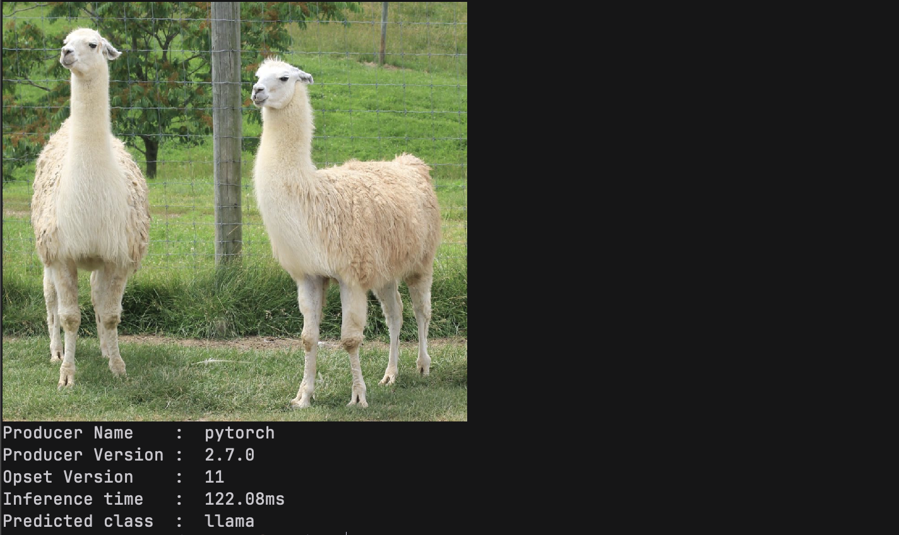

<p align="center">
  
</p>

<p align="center">
  Neural network inference in pure Odin
</p>

## What this is

Anvil runs neural networks without the typical ML stack.
Load a safetensors or ONNX file, run inference, get results.
Currently implements enough operations to run vision models such as ResNet, YOLOv8, SAM (TinyViT).
Your deployment is just a binary.
No Python, no gigabytes of dependencies.
Just compiled code running models.

> [!WARNING]
> This package is only tested (in the order of comprehensiveness) on macOS (MacBook M1), Ubuntu 22.04, and Windows 11. It requires Accelerate framework on macOS and `openblas-dev` on Linux. 
> Windows users can get precompiled [OpenBLAS](https://github.com/OpenMathLib/OpenBLAS) `.lib` file from their release page and drop it on `lib/windows` directory. So far that's the easiest way to get this running.

## Safetensors Models

### Segment Anything Model (TinyViT-5M Backbone)

Download `mobile_sam-tiny-vitt.safetensors` from [here](https://huggingface.co/lmz/candle-sam/tree/main). Drop it in `weights/` and run:

```bash
$ odin run examples/sam_raylib -o:speed -no-bounds-check
```

<p align="center">
  
</p>

### YOLOv8 Object detection

See `examples/yolo_simple`

```bash
$ odin build examples/yolo_simple -o:speed -no-bounds-check
$ ./yolo_simple weights/yolov8m.safetensors /path/to/image.jpg m
```

## ONNX Models
> [!CAUTION]
> Still at a very limited supported. Consult `anvil/onnx/execution.odin`'s `run` procedure for the currently supported ops. Yes, that large switch-case.

### ResNet-50

```bash
$ odin build examples/resnet50_onnx -o:speed -no-bounds-check
$ ./resnet50_onnx /path/to/image.jpg
```
<p align="center">
  
</p>

## Notes on Memory Management

This package uses `context.temp_allocator` for intermediate computations and uses the passed allocator argument for the function return values.
If you're doing operations in a loop, just reset the temp allocator periodically:


```odin
for item in items {
    // Your tensor ops / model inference here
    // ...

    free_all(context.temp_allocator)  // Clear intermediates
}
```

## Status

Early development, APIs are unstable. More models coming as operations get implemented.

## Requirements

- Odin compiler
- A safetensors or ONNX file: skip this if you only care about using the tensor data structure.
- OpenBLAS (`libopenblas-dev` on Ubuntu, precompiled `.lib` for Windows)
- That's it
